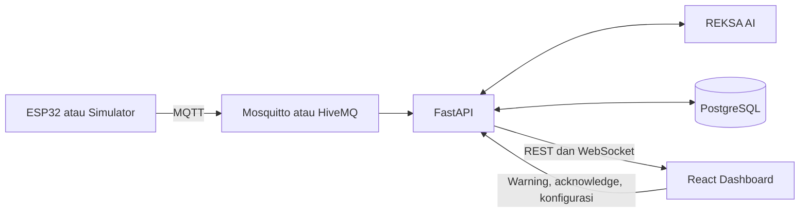

# REKSA

**Radar Evaluasi K3 dan Sensor Ancaman Kerja**

REKSA adalah sistem pemantauan keselamatan kerja berbasis IoT untuk mendeteksi risiko pekerja di sekitar forklift dan peralatan industri. Sistem menggabungkan telemetri helm, deteksi kedekatan BLE, aturan keselamatan lokal, pencatatan near miss, dan dashboard pemantauan langsung.

## Fitur utama

- Pemantauan pekerja dan perangkat secara real time melalui MQTT dan WebSocket.
- Klasifikasi risiko berdasarkan kedekatan, kondisi lingkungan, dan benturan.
- Peringatan lokal pada helm yang tetap bekerja tanpa koneksi cloud.
- Pencatatan near miss dan riwayat paparan risiko.
- Advisory prediktif dari jendela data BLE-RSSI dan MPU6050.
- Mode simulasi untuk pengembangan dan demonstrasi tanpa perangkat fisik.

Advisory prediktif tidak menggantikan aturan keselamatan pada perangkat. Seluruh data bawaan untuk demonstrasi ditandai sebagai `SIMULATION DATA`.

## Arsitektur



Komponen utama:

- `frontend`: dashboard React, halaman operasional, state management, dan pengujian UI.
- `backend`: API FastAPI, layanan keselamatan, simulasi, WebSocket, dan penyimpanan data.
- `AI`: pipeline dataset, pelatihan model, inferensi, serta layanan advisory.
- `arduino`: firmware helm dan node hazard berbasis ESP32.
- `bridge`: gateway MQTT ke Google Cloud Pub/Sub dengan outbox lokal.
- `deploy`: skrip deployment dan pemeriksaan prasyarat cloud.
- `docs`: dokumentasi arsitektur, API, topik MQTT, deployment, dan skenario demo.

Detail teknis tersedia di [arsitektur](docs/architecture.md), [kontrak MQTT](docs/mqtt-topics.md), dan [API](docs/api.md).

## Persyaratan

Untuk menjalankan seluruh layanan dengan Docker:

- Docker 24 atau lebih baru.
- Docker Compose v2.
- Port `5173`, `8000`, `1883`, dan `9001` tersedia.

Pengembangan tanpa Docker memerlukan Python 3.11 sampai 3.13 dan Node.js 22 atau lebih baru.

## Menjalankan dengan Docker

```bash
docker compose up --build
```

Dashboard tersedia di `http://localhost:5173` dan dokumentasi API di `http://localhost:8000/docs`.

Untuk menghentikan layanan:

```bash
docker compose down
```

## Pengembangan lokal

Siapkan backend:

```bash
python3 -m venv .venv
. .venv/bin/activate
pip install -r backend/requirements.txt
cp backend/.env.example backend/.env
cd backend
alembic upgrade head
uvicorn app.main:app --reload
```

Jalankan frontend pada terminal lain:

```bash
cd frontend
npm install
cp .env.example .env
npm run dev
```

Layanan advisory dapat dijalankan secara terpisah:

```bash
cd AI
pip install -e .
uvicorn reksa_ai.service:app --host 0.0.0.0 --port 8100
```

Nilai konfigurasi pengembangan tersedia pada berkas `.env.example` di masing-masing komponen. Jangan menyimpan kredensial atau nilai rahasia ke Git.

## Perangkat ESP32

1. Salin `arduino/helm_v1/secrets.example.h` menjadi `arduino/helm_v1/secrets.h`.
2. Isi kredensial Wi-Fi dan broker MQTT.
3. Sesuaikan identitas pekerja dan perangkat.
4. Kalibrasi ambang RSSI berdasarkan kondisi lapangan.
5. Unggah firmware helm dan node hazard melalui Arduino IDE atau PlatformIO.

Payload perangkat harus mengikuti [kontrak topik MQTT](docs/mqtt-topics.md). Setiap pesan memerlukan `message_id` unik dan timestamp ISO 8601 dengan zona waktu.

## Pengujian

Jalankan seluruh pengujian:

```bash
make test
```

Jalankan pemeriksaan statis dan build frontend:

```bash
make lint
```

Perintah komponen:

```bash
cd backend && pytest && ruff check .
cd ../AI && pytest && ruff check .
cd ../frontend && npm test && npm run lint && npm run build
```

## Deployment

- [Panduan deployment](PANDUAN-DEPLOY-STEP-BY-STEP.md)
- [Arsitektur cloud](docs/cloud-deployment.md)
- [Workflow evaluasi model](docs/ai-evidence-workflow.md)

Deployment demonstrasi menggunakan persona supervisor tetap dan belum menyediakan autentikasi produksi. Tambahkan autentikasi, otorisasi, pengelolaan rahasia, dan audit akses sebelum digunakan di lingkungan operasional.
