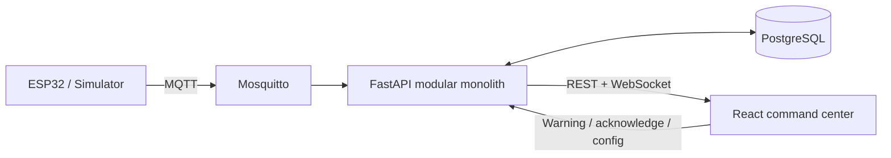

# REKSA

**Radar Evaluasi K3 dan Sensor Ancaman Kerja**  
Industrial Safety Monitoring System — Dynamic Hazard Awareness and Near-Miss Tracking.

REKSA adalah aplikasi full-stack IoT untuk memantau risiko pekerja di sekitar forklift dan peralatan industri. Aplikasi menyediakan dashboard real-time, live monitoring pekerja, registry perangkat IoT, near-miss otomatis, dan peringatan helm.

> Semua seed dan analytics bawaan ditandai **SIMULATION DATA**. Skor risiko dihitung dari aturan operasional berbasis sensor.

## Architecture



Dokumentasi detail: [architecture](docs/architecture.md), [MQTT topics](docs/mqtt-topics.md), [API](docs/api.md), dan [demo flow](docs/demo-scenarios.md).

## Stack

- Frontend: React 19, Vite, strict TypeScript, TanStack Query, Zustand, React Router, Recharts, Lucide.
- Backend: FastAPI, Pydantic, SQLAlchemy, Alembic, paho-mqtt, WebSocket.
- Infrastructure: PostgreSQL 17, Eclipse Mosquitto 2, Docker Compose, Nginx.
- Tests: Pytest, Ruff, Vitest, Testing Library, ESLint.

## Prerequisites

- Docker 24+ dan Docker Compose v2; atau Node.js 22+ dan Python 3.11–3.13.
- Port 5173, 8000, 1883, dan 9001 tersedia.

## Quick start with Docker

```bash
cd reksa
docker compose up --build
```

Buka `http://localhost:5173`. API docs berada di `http://localhost:8000/docs`. Compose menunggu health check PostgreSQL dan Mosquitto sebelum memulai backend, lalu menunggu backend sehat sebelum frontend.

## Local installation

```bash
cd reksa
python3 -m venv .venv
. .venv/bin/activate
pip install -r backend/requirements.txt
cd frontend && npm install && cd ..
cp backend/.env.example backend/.env
cp frontend/.env.example frontend/.env
```

Terminal 1:

```bash
cd backend
alembic upgrade head
uvicorn app.main:app --reload
```

Terminal 2:

```bash
cd frontend
npm run dev
```

SQLite dipakai oleh `.env.example` untuk local development. Docker mengatur `DATABASE_URL` PostgreSQL secara otomatis.

## Environment variables

| Variable | Default | Description |
|---|---|---|
| `DATABASE_URL` | `sqlite:///./reksa.db` | SQLAlchemy connection URL |
| `MQTT_HOST` / `MQTT_PORT` | `localhost` / `1883` | Mosquitto connection |
| `CORS_ORIGINS` | `http://localhost:5173` | Comma-separated explicit origins |
| `DEVICE_OFFLINE_TIMEOUT` | `30` | Seconds before marking offline |
| `VITE_API_URL` | `/api/v1` | Frontend REST base URL |
| `VITE_WS_URL` | `/ws/live` | Frontend WebSocket URL |

## Live-device mode and ESP32 notes

1. Matikan simulation mode dan arahkan ESP32 ke Mosquitto.
2. Publish JSON sesuai [MQTT topic contract](docs/mqtt-topics.md), dengan timestamp ISO 8601 timezone-aware dan `message_id` unik.
3. Gunakan QoS 1. Helm subscribe pada `REKSA/helmet/{worker_id}/warning`.
4. Kalibrasi RSSI per area. RSSI tidak digunakan sebagai klaim koordinat x-y presisi; peta awal memakai koordinat konfigurasi/simulasi.
5. Firmware wajib mengirim status berkala lebih cepat dari offline timeout.

## Testing and linting

```bash
make test
make lint
# atau
cd backend && pytest && ruff check .
cd frontend && npm test && npm run lint && npm run build
```

## Demo identity

Versi lomba tidak memiliki login kompleks. Persona tetap yang terlihat di UI: **Raka Wijaya — Supervisor K3**. Jangan gunakan deployment ini sebagai sistem autentikasi produksi tanpa menambahkan SSO/session management.

## Troubleshooting

- **WS reconnecting**: pastikan backend `/api/v1/health` merespons dan proxy `/ws` aktif.
- **MQTT simulated**: normal di simulation mode. Periksa port 1883 serta log container untuk live mode.
- **Database unavailable**: tunggu health check atau jalankan `docker compose logs postgres`.
- **Skor risiko tidak berubah**: cek payload MQTT, RSSI hazard, suhu, impact, dan kualitas udara yang masuk ke backend.
- **Port conflict**: ubah host port di `docker-compose.yml`, bukan container port.

## Project structure

```text
reksa/
├── frontend/       # React command center, pages, stores, tests
├── backend/        # FastAPI, SQLAlchemy models, safety services
├── mosquitto/      # Broker configuration and persisted data
├── docs/           # Architecture, MQTT, API, and demo guide
├── docker-compose.yml
├── Makefile
└── README.md
```
