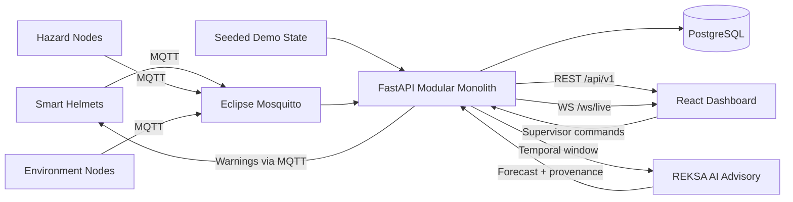
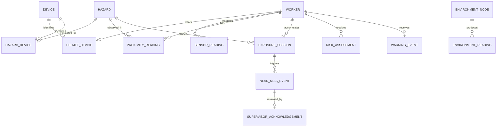

# Arsitektur REKSA

REKSA menggunakan modular monolith. FastAPI adalah satu-satunya pemilik logika proximity, exposure, near-miss, warning, risk, simulasi, dan agregasi historis. React hanya menampilkan state dan mengirim intent supervisor.

AI bersifat **advisory-only**. Warning lokal pada helm dan state machine backend tidak
menunggu respons AI. Bila service AI tidak tersedia, dashboard menampilkan status
`UNAVAILABLE` tanpa membuat probabilitas pengganti.

Domain backend dipisahkan ke `schemas`, `models`, `services`, `simulation`, dan `api`. Deployment tetap empat container agar mudah didemonstrasikan dan dirawat.

## Relasi data

